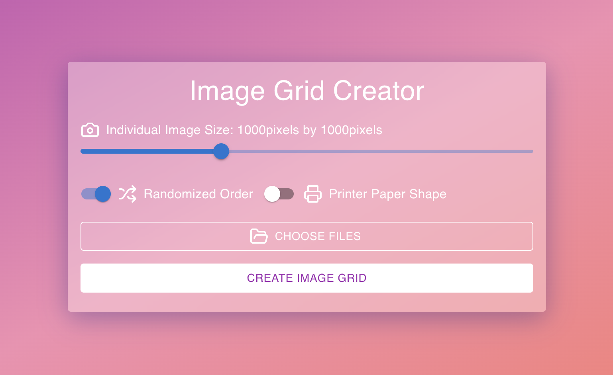

# Image Grid Creator

This application allows users to create image grids from multiple images. It consists of a React frontend and a Flask backend.

User Interace


Example Output


## Prerequisites

- Python 3.7+
- Node.js 12+
- npm 6+

## Setup

Clone the repository and navigate to the project directory:

```bash
git clone <repository-url>
cd image-grid-creator
```

### Backend Setup

1. Navigate to the backend directory:
   ```bash
   cd backend
   ```

2. Create a virtual environment:
   ```bash
   python -m venv venv
   ```

3. Activate the virtual environment:
   - On Windows:
     ```
     venv\Scripts\activate
     ```
   - On macOS and Linux:
     ```
     source venv/bin/activate
     ```

4. Install the required Python packages:
   ```bash
   pip install -r requirements.txt
   ```

5. Start the Flask server:
   ```bash
   python app.py
   ```

The backend should now be running on `http://localhost:5000`.

### Frontend Setup

1. Open a new terminal window and navigate to the frontend directory:
   ```bash
   cd frontend
   ```

2. Install the required npm packages:
   ```bash
   npm install
   ```

3. Start the React development server:
   ```bash
   npm start
   ```

The frontend should now be running on `http://localhost:3000`.

## Usage

1. Open your web browser and go to `http://localhost:3000`.
2. Use the interface to select images, adjust settings, and generate your image grid grid.
3. The generated image grid will be downloaded automatically.

## Troubleshooting

- If you encounter CORS issues, ensure that the backend is running and that the CORS configuration in `app.py` is correct.
- If you have trouble uploading images, check that the `UPLOAD_FOLDER` in `app.py` exists and has the correct permissions.

For any other issues, please check the console logs in your browser and the terminal running the Flask server for error messages.