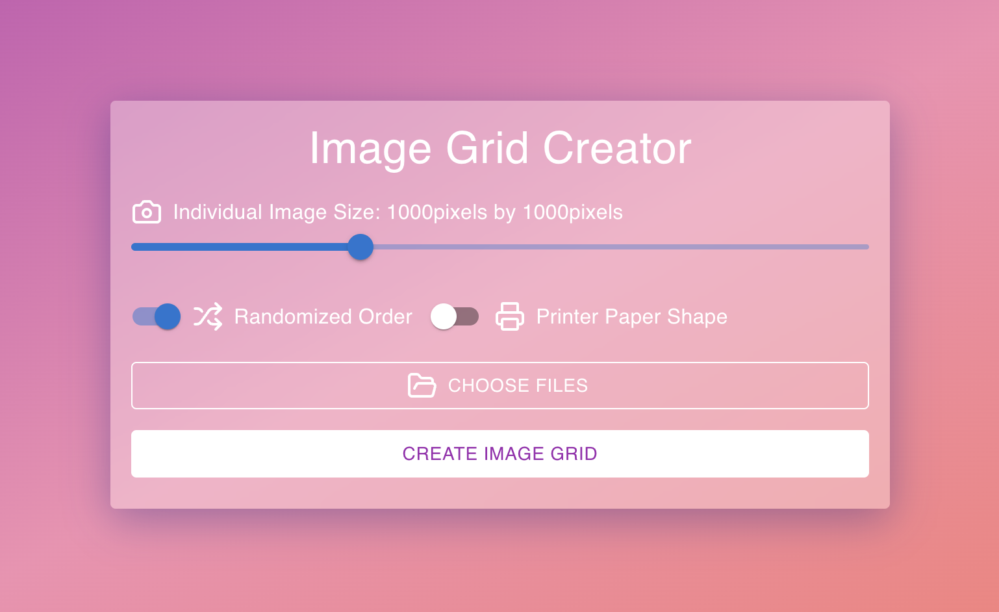

# Image Grid Creator

Create a downloadable PNG grid from a batch of images. The app has a Flask backend
for image processing and a React frontend for upload/settings/download.




## What Changed

- Large uploads now return a clear `413` instead of being swallowed as a generic
  `500`.
- The default backend upload limit is now 2 GB. Override it with `MAX_UPLOAD_MB`.
- Grid generation computes real rows and columns, including printer-paper-shaped
  layouts, instead of relying on repeated square-root rounding.
- Images are processed one at a time, EXIF orientation is handled with Pillow, and
  uploads are no longer copied into permanent batch folders.
- A `Stretch squares` toggle can force every image to fill its square cell when
  you prefer a tight grid with no padding between images.
- HEIC/HEIF uploads are decoded in memory with `pillow-heif`; source files are
  only read, never modified.
- The frontend now shows inline errors and separates upload progress from the
  backend generation phase.

## Requirements

- Python 3.8+
- Node.js 16+
- npm

## Backend

```bash
cd backend
python -m venv venv
source venv/bin/activate
pip install -r requirements.txt
python app.py
```

The API runs at `http://127.0.0.1:5000`.

Optional environment variables:

```bash
MAX_UPLOAD_MB=2048
MAX_OUTPUT_PIXELS=300000000
OUTPUT_FOLDER=/path/to/outputs
```

## Frontend

```bash
cd frontend
npm install
npm start
```

The React app runs at `http://localhost:3000`.

To point the frontend at a different backend:

```bash
REACT_APP_API_BASE_URL=http://127.0.0.1:5000 npm start
```

## Tests

```bash
cd backend
./venv/bin/python -m unittest discover -s tests
```

```bash
cd frontend
npm test -- --watchAll=false
npm run build
```

## Troubleshooting

- `413 Upload is too large`: lower the batch size, compress images, or raise
  `MAX_UPLOAD_MB`.
- `Requested grid is too large`: lower the cell size or split the batch. This
  protects the backend from creating a huge in-memory PNG.
- HEIC files fail to open: reinstall backend requirements with
  `pip install -r requirements.txt` and restart Flask.
- `No response from the backend`: make sure Flask is running on port `5000`, or
  set `REACT_APP_API_BASE_URL` to the backend URL you are using.
